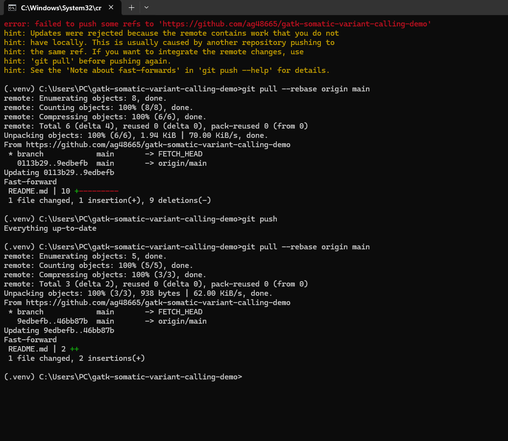

# Tumor–Normal Somatic Variant Calling Pipeline


Reproducible tumor–normal somatic variant calling workflow demonstrating cancer genomics analysis using BWA, minimap2, SAMtools, GATK Mutect2, and Python-based pipeline orchestration.

---

## Project Overview

Somatic variant calling is a fundamental component of cancer genomics, enabling the identification of mutations present in tumor cells but absent from matched normal tissue.

This project demonstrates an end-to-end workflow for processing paired tumor–normal sequencing data, generating aligned BAM files, calling somatic variants, and producing filtered candidate SNVs and indels suitable for downstream analysis.

The repository combines bioinformatics workflow development, software engineering, and reproducible genomics practices commonly used in academic research, biotechnology, and precision oncology.

---

## Project Highlights

✔ Tumor–normal variant calling workflow

✔ GATK Mutect2 somatic mutation detection

✔ BWA and minimap2 alignment support

✔ BAM sorting and indexing with SAMtools

✔ Automated VCF filtering

✔ Python workflow orchestration

✔ YAML-based configuration

✔ GitHub Actions CI/CD

✔ Reproducible bioinformatics pipeline

---

## Biological Context

Cancer develops through the accumulation of somatic mutations that alter cellular growth, survival, and genomic stability.

Somatic variant calling workflows compare tumor sequencing data against matched normal samples to identify mutations that may contribute to cancer development and progression.

This project demonstrates the computational steps required to detect these variants using widely adopted genomics tools and best practices.

---

## Pipeline Overview

```text
FASTQ tumor/normal
      |
      v
BWA or minimap2 alignment
      |
      v
SAMtools sort + index
      |
      v
GATK Mutect2
      |
      v
GATK FilterMutectCalls
      |
      v
Filtered somatic VCF + summary table
```

---

## Workflow Demonstration

### Pipeline Dry Run



Example execution of the workflow showing automated generation of analysis commands and processing steps.

---

## Key Outputs

The workflow generates:

* Aligned BAM files
* Indexed BAM files
* Raw somatic VCF files
* Filtered somatic VCF files
* Variant summary tables
* Pipeline execution logs

---

## Public Data Compatibility

The workflow is compatible with publicly available educational datasets, including:

* Broad Institute GATK tutorial datasets
* NIH / NCBI Sequence Read Archive (SRA)
* NCI Genomic Data Commons reference workflows

No controlled-access human sequencing data are included in this repository.

---

## Methods

### Read Alignment

Supported aligners:

* BWA-MEM
* minimap2

### BAM Processing

* Coordinate sorting
* BAM indexing
* Alignment quality control

### Somatic Variant Calling

* GATK Mutect2
* Tumor–normal comparison
* SNV detection
* Indel detection

### Variant Filtering

* GATK FilterMutectCalls
* Generation of high-confidence candidate variants

---

## Example Commands

```bash
bwa mem -t 4 reference.fa tumor_R1.fastq.gz tumor_R2.fastq.gz | samtools sort -o tumor.bam

samtools index tumor.bam

gatk Mutect2 \
  -R reference.fa \
  -I tumor.bam \
  -I normal.bam \
  -tumor TUMOR \
  -normal NORMAL \
  -O unfiltered.vcf.gz

gatk FilterMutectCalls \
  -R reference.fa \
  -V unfiltered.vcf.gz \
  -O filtered.vcf.gz
```

---

## Repository Structure

```text
gatk-somatic-variant-calling-demo/
│
├── src/
│   └── somatic_pipeline/
│
├── scripts/
│
├── cpp/
│
├── workflows/
│
├── config/
│
├── examples/
│
├── tests/
│
├── docs/
│
└── README.md
```

---

## Quick Start

### Create Environment

```bash
conda env create -f environment.yml
conda activate somatic-variant-pipeline
```

### Run Pipeline

```bash
python -m somatic_pipeline.cli run \
  --config config/example_config.yaml
```

Replace the example file paths with local FASTQ and reference genome files.

---

## Technologies Used

### Bioinformatics

* GATK Mutect2
* BWA
* minimap2
* SAMtools

### Programming

* Python
* YAML
* C++ (optional utility)

### DevOps

* GitHub Actions
* Docker
* Linux

---

## Potential Applications

* Cancer genomics research
* Somatic mutation discovery
* Precision oncology workflows
* Variant interpretation pipelines
* Genomic biomarker studies
* Reproducible NGS analysis

---

## Skills Demonstrated

### Cancer Bioinformatics

* Somatic variant calling
* Tumor–normal analysis
* NGS data processing
* Variant filtering

### Bioinformatics Engineering

* Pipeline development
* Workflow orchestration
* Configuration management
* Reproducible genomics workflows

### Software Engineering

* Python CLI development
* Testing and validation
* CI/CD automation
* Modular code design

### Tools

* Python
* GATK
* BWA
* minimap2
* SAMtools
* Docker
* GitHub Actions

---

## Notes

This repository is intended for educational, research, and portfolio purposes.

It is not a clinical diagnostic workflow and should not be used for patient care or medical decision-making.

---

## Author

**Agata Gabara**

MSc Bioinformatics Student

Research Interests:

* Cancer Genomics
* Variant Calling
* Precision Oncology
* NGS Analysis
* Bioinformatics Infrastructure

GitHub: https://github.com/ag48665

LinkedIn: https://www.linkedin.com/in/agatha-gabara-06494a37/
